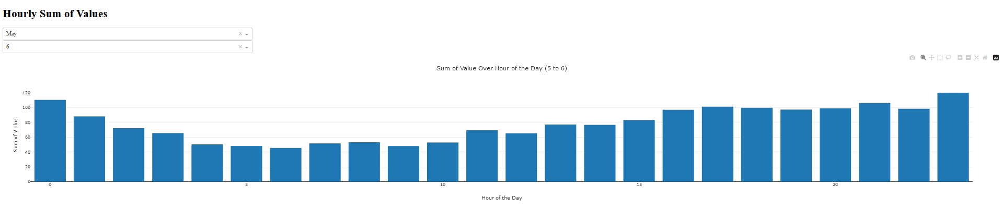

# energy_usage_dash
A dash app that will be used to visualize some of the energy usage data for my house from my house's smart meter

## Background

This dash app takes in an energy usage XML file in accordance with the Green Button standard and displays some analytics graphs about energy usage. There is currently
only one graph in the dashboard and it is not a polished presentation. The graph is below.

## Usage

- Clone the repo
- Download your little green button energy use XML from your power providers website. Change the name to "energy_usage.xml" and put it in the same directory
- Install the requirements from requirements.txt
- Run the server with "python app.py"

### Next Steps

Home
- Add the ability to upload XML files on the homepage for custom analysis
- Format with bootstrap to make it pretty

Analytics
- Add some summary statistics at the top of the analytics page regarding the file that was uploaded (time span, total Kwh, etc.)
- Add the other analysis graphs I want in the components page

Forecasting
- Find/Make small static dataset for energy costs (e.g. different time of use plans in a certain area or average kwh cost by state) to forecast energy costs
- Consider pre-defined options to change energy usage to change forecasting scenario